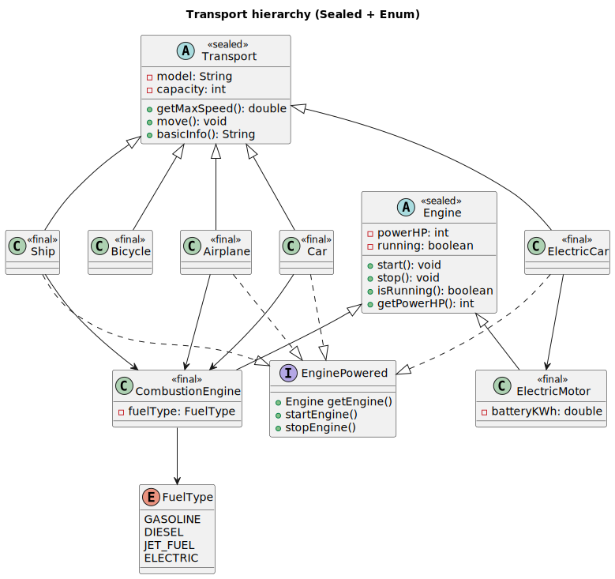

<!-- prettier-ignore-start -->

# Описание решения

| 🧱 Иерархия (Sealed)                                      | 🚗 Виды транспорта                                                           | ⚡ Энергия и двигатели                                                             |
| --------------------------------------------------------- | ---------------------------------------------------------------------------- | --------------------------------------------------------------------------------- |
| Базы: `Transport`, `Engine` (наследники ограничены `permits`). | `Car`, `Airplane`, `Ship`, `Bicycle`, `ElectricCar` — все `final`.            | `CombustionEngine` (топливо: `GASOLINE`/`DIESEL`/`JET_FUEL`), `ElectricMotor` (кВт·ч). |
| Контракты: `EnginePowered` — для всего моторизованного.   | Немоторизованный: `Bicycle`. Моторизованные реализуют `EnginePowered`.       | Параметры: мощность (л.с.), ёмкость батареи (кВт·ч), тип топлива.                  |

| 🧭 Поведение и операции                             | 🎛️ Консольный интерфейс                                                                 | 🔗 Отношения между сущностями                                                           |
| -------------------------------------------------- | ---------------------------------------------------------------------------------------- | --------------------------------------------------------------------------------------- |
| Общее для всех: `getMaxSpeed()`, `move()`, вывод информации. | Меню: создание объектов всех типов, список, инфо, запуск/стоп двигателя, действие `move()`. | `Transport` → `Car`/`Airplane`/`Ship`/`Bicycle`/`ElectricCar`; `Engine` → `CombustionEngine`/`ElectricMotor`; `EnginePowered` — контракт для моторизованных. |

| ✅ Валидация ввода                                                                 | 🧩 Сочетания сущностей                                                                                                               | 🔒 Инварианты и целостность                                                                                   |
| ---------------------------------------------------------------------------------- | ------------------------------------------------------------------------------------------------------------------------------------ | ---------------------------------------------------------------------------------------------------------------- |
| Числа — только положительные/валидные; диапазоны — через явный выбор; строки — без пустых; поддерживается точка/запятая для десятичных. | `Car` → `CombustionEngine` (GASOLINE/DIESEL); `Airplane` → `CombustionEngine` (JET_FUEL); `Ship` → `CombustionEngine` (DIESEL); `ElectricCar` → `ElectricMotor`; `Bicycle` — без двигателя. | Виды транспорта — `final`; базовые классы — `sealed`; поля — неизменяемые; `Engine` управляет `running` через `start()/stop()`; обязательные параметры проверяются. |

# Диаграмма

Диаграмма строится из `transport_uml.puml`. Изображение `SVG` добавляется автоматически после изменений.

<!-- prettier-ignore-end -->
